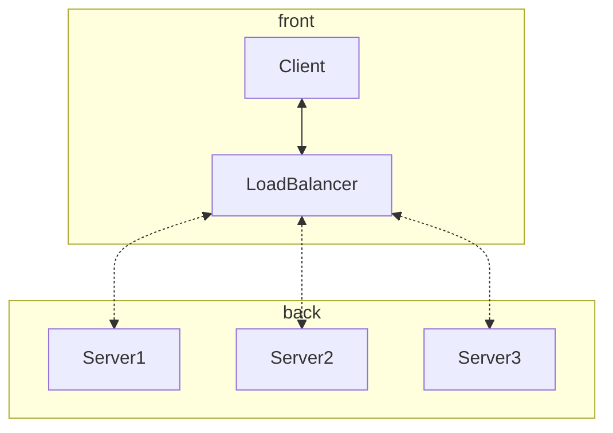
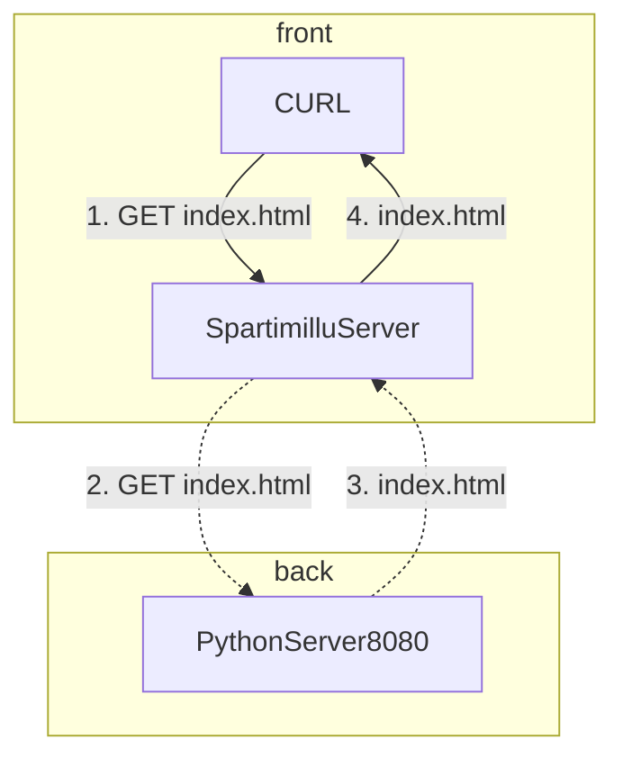
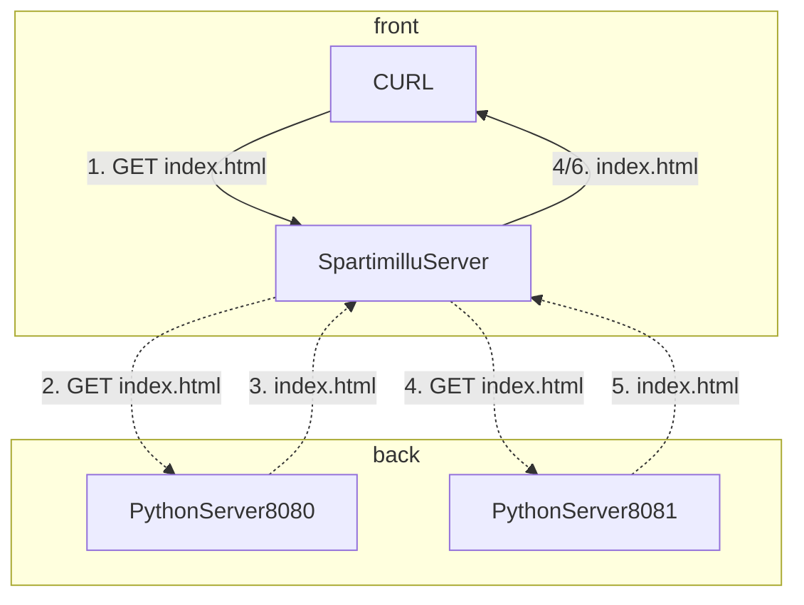
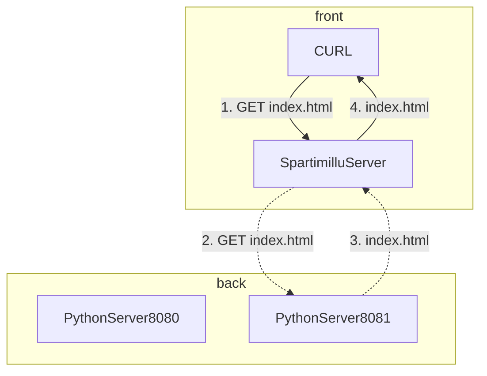

Since the last time I had too much fun, I wanted to [repeat the experiment by taking another Coding Challenge](https://domenicoluciani.com/2024/01/29/creating-a-word-count-clone-with-golang.html). This time I'm gonna explain how I implemented an Application Load Balancer in Golang.   
Let's go! 🚀


## Application Layer Load Balancer

Let's start by describing what is an Application Layer Load Balancer which is important to understand what it does and where are the complexities behind implementing it.

> Usually a Load Balancer sits in front of a group of servers and routes client requests across all of the servers that are capable of fulfilling those requests.

Load Balancers ensure that the traffic is equally distributed between our healthy servers minimising the response time.

There are different types of load balancers, they can work at different levels of the [OSI](https://en.wikipedia.org/wiki/OSI_model#Layer_architecture). In this case, I'm gonna be focusing on layer seven of the stack, which will route HTTP requests from clients to a pool of HTTP servers.

### Functionalities

* Distributes client requests efficiently across multiple servers
* Ensures high availability and reliability by sending requests only to servers that are online



### Goals of this challenge

* Build a load balancer that can forward traffic to two or more servers.
* Health check the servers
* Handle a server going offline
* Handle a server coming back online


## Preface

Just a friendly reminder that the process I took can be avoided, improved, and of course, wrong.   
I’m just telling my story and my Golang-improving journey through this post.   
Feel free to give me feedback about it and, if it makes you learn something new or reflect on a topic you never thought about, just let me know ☀️

## First Requirement: Creating a simple request forwarder

First of all, I needed to create a simple server, Golang is very powerful and it allows you to do so in a few steps.

In the main for example, we can have:
```go
http.HandleFunc("/", func(writer http.ResponseWriter, request *http.Request) {  
    fmt.Printf("Received request from %s\n", request.RemoteAddr)  
    fmt.Printf("%s / %s\n", request.Method, request.Proto)  
    fmt.Printf("%s / %s\n", request.Method, request.Proto)  
    fmt.Printf("Host: %s\n", request.Host)  
    fmt.Printf("User-Agent: %s\n", request.Header.Get("User-Agent"))  
    fmt.Printf("Accept: %+v\n\n", request.Header.Get("Accept"))  
    fmt.Printf("Replied with a hello message\n")  
    fmt.Fprintf(writer, "Hello From Backend Server")  
})  
err := http.ListenAndServe(":80", nil)  
if err != nil {  
    log.Fatal("Error listening and serve")  
}
```

And once run we will have our small server listening at the `80` port, logging each request that has been received at the `/` endpoint.

To verify it you can just call `curl http://localhost/ --output -` having as a result: `Hello From Backend Server`.

Of course, it's not enough to have a service that forwards our requests to specified servers but it's a start to understand how Golang works.

So to get back to our problem, I started with a unit test:

```go
t.Run("should call the client to forward the request", func(t *testing.T) {  
    req, _ := http.NewRequest(http.MethodGet, "/", nil)  
    resp := httptest.NewRecorder()  
    mockClient := newMockClient()  
    spartimillu := NewSpartimilluServer(mockClient)  
    mockClient.On("ForwardRequest", mock.Anything).Return(&http.Response{  
       Status:     "200 OK",  
       StatusCode: 200,  
       Proto:      "HTTP/1.0",  
       Body:       io.NopCloser(bytes.NewBufferString("dummy body")),  
       Request:    req,  
    })  
    spartimillu.ServeHTTP(resp, req)  
  
    mockClient.AssertExpectations(t)  
    assert.Equal(t, "dummy body", resp.Body.String(), "got %q, want %q", resp.Body.String(), "dummy body")  
})
```

With this test:

* I create a new mockedRequest specifying the method and the endpoint.
* Create some mocked response thanks to the `httptest` package.
* Create a mocked client.

```go
type MockClient struct {  
    mock.Mock  
}  
  
func newMockClient() *MockClient { return &MockClient{} }  
  
func (m *MockClient) ForwardRequest(req http.Request) *http.Response {  
    args := m.Called(req)  
    return args.Get(0).(*http.Response)  
}  
  
func (m *MockClient) HealthCheck() {  
    m.Called()  
}
```

* I provide my mocked client as a parameter for my load balancer server that I called `SpartimilluServer`.
```go
type SpartimilluServer struct {  
    client client.Client  
}  
  
func NewSpartimilluServer(client client.Client) *SpartimilluServer {  
    return &SpartimilluServer{client: client}  
}
```

* I mock the `ForwardRequest` function to return a custom response with `dummy body` as a body.
* And then call the function under test: `ServeHttp`.
* Checking that the body of the response that we get back is equal to what we are expecting.

The implementation was quite straightforward:
```go
func (s *SpartimilluServer) ServeHTTP(w http.ResponseWriter, r *http.Request) {  
    fmt.Printf("Received request from %s\n", r.RemoteAddr)  
    fmt.Printf("%s / %s\n", r.Method, r.Proto)  
    fmt.Printf("%s / %s\n", r.Method, r.Proto)  
    fmt.Printf("Host: %s\n", r.Host)  
    fmt.Printf("User-Agent: %s\n", r.Header.Get("User-Agent"))  
    fmt.Printf("Accept: %+v\n", r.Header.Get("Accept"))  
  
    resp := s.client.ForwardRequest(*r)  
  
    fmt.Printf("Response from server: %s %s\n\n", resp.Proto, resp.Status)  
  
    body, err := io.ReadAll(resp.Body)  
    if err != nil {  
       http.Error(w, "Error reading the response body", http.StatusInternalServerError)  
    }  
    stringBody := string(body)  
    fmt.Fprint(w, stringBody)  
    fmt.Println(stringBody)  
}
```

### Forward Request

Now we need to implement our client and its functionalities.

Let's start with an integration test!

```go
t.Run("should forward a GET request to a specific server", func(t *testing.T) {  
    server, address := startTestServer(t, "ok")  
    defer server.Close()  
    conf := NewSpartimilluClientConf([]string{address})  
    client := NewSpartimilluClient(conf)  
    req := httptest.NewRequest(http.MethodGet, "/", nil)  
  
    resp := client.ForwardRequest(*req)  
  
    body := getBodyFromResp(t, resp)  
    assert.Equal(t, http.MethodGet, resp.Request.Method, "got %v, wanted %v", resp.Request.Method, http.MethodGet)  
    assert.Equal(t, http.StatusOK, resp.StatusCode, "got %v, wanted %v", resp.StatusCode, http.StatusOK)  
    assert.Equal(t, "ok", body, "got %v, wanted %v", body, "ok")  
})
```

So let's see what is happening here:
* Golang gives us the fantastic opportunity to spawn up a local stub server with just a few lines of code using the `httptest` package and defer it with the `Close` method:

```go
func startTestServer(t *testing.T, bodyResponse string) (*httptest.Server, string) {  
    t.Helper()  
  
    server := httptest.NewServer(http.HandlerFunc(func(writer http.ResponseWriter, request *http.Request) {  
       fmt.Printf("%s has been called\n", bodyResponse)  
       fmt.Fprint(writer, bodyResponse)  
    }))    
    return server, server.URL  
}
```

As you can see we are using the `NewServer` method to spawn up a new server and then set a handler function to get back some info.

* I wanted to have flexibility in terms of configuration so I created a `SpartimilluClientConf` struct:

```go
type SpartimilluClientConf struct {  
    addresses           []string
}  
  
func NewSpartimilluClientConf(addresses []string) SpartimilluClientConf {  
    return SpartimilluClientConf{addresses: addresses}  
}
```

As you can see it just contains some info like addresses and the health-check endpoint (we will get there later).

* I created the client passing the conf as a dependency
* Then call the `ForwardRequest` method passing the request I created.
* Some assertions, to verify that everything is as expected.   For example to read the body:
```go
func getBodyFromResp(t *testing.T, resp *http.Response) string {  
    t.Helper()  
  
    bodyBytes, err := io.ReadAll(resp.Body)  
    assert.Nil(t, err)  
    return string(bodyBytes)  
}
```

To then jump into the implementation:
```go
type Client interface {  
    ForwardRequest(req http.Request) *http.Response  
}  
  
type SpartimilluClient struct {  
    conf SpartimilluClientConf  
}  
  
func NewSpartimilluClient(conf SpartimilluClientConf) *SpartimilluClient {  
    return &SpartimilluClient{conf: conf}  
}  
  
func (s *SpartimilluClient) ForwardRequest(req http.Request) *http.Response {  
    switch req.Method {  
    case http.MethodGet:  
       return sendGetRequestToAnotherServer(s.conf.address + req.RequestURI)
    }    
    return nil  
}  
  
func sendGetRequestToAnotherServer(url string) *http.Response {  
    body, err := http.Get(url)  
    if err != nil {  
       log.Fatal("Can't read the response body from the GET request")  
    }
    return body  
}
```

As you can see I just called the `http.Get(url)` method emulating the `GET` request we got.

### Try it out

To see everything in action we can just call our main:

```go
func main() {  
    spartimilluClient := client.NewSpartimilluClient(client.NewSpartimilluClientConf("http://localhost:8080"))  
    spartimilluServer := server.NewSpartimilluServer(spartimilluClient)  
    log.Fatal(http.ListenAndServe(":80", spartimilluServer))  
}
```

* In this case I spawned up a separate server listening at the port `8080` and provided it into the configuration.
* Then created my `SpartimilluServer` function handler and used it for my `ListenAndServe` function.

To spawn up my little server you can use a different main with the code you saw before or just create a directory called for example `server8080` containing an `index.html` file with this content:

```html
<!DOCTYPE html>  
<html lang="en">  
    <head>  
       <meta charset="utf-8">  
       <title>Index Page</title>  
    </head>  
    <body>  
       Hello from the web server running on port 8080.  
    </body>  
</html>
```

and run in your terminal: `python -m http.server 8080 --directory server8080`, it will spawn up a python server serving the content of the directory `directory8080`.

So then you can just call your young load balancer: `curl http://localhost/ --output -`.

The result will be:

```bash
❯ curl http://localhost/ --output -
<!DOCTYPE html>
<html lang="en">
	<head>
		<meta charset="utf-8">
		<title>Index Page</title>
	</head>
	<body>
		Hello from the web server running on port 8080.
	</body>
</html>
```



## Second Requirement: Distribute traffic with Round Robin

Now that we have our "forwarder" in place, we have to distribute the incoming requests using a scheduling algorithm called "Round Robin".   
It's quite simple, we just need to distribute the traffic to each server in the list, one after the other and once forwarded to all of them we start back at the beginning of the list.

For example:

| Server | Request |
| ---- | ---- |
| A | 1, 4 |
| B | 2, 5 |
| C | 3, 6 |


Let's start with another integration test:

```go
t.Run("should forward a GET request to any server using a round robin algorithm", func(t *testing.T) {  
    server1, address1 := startTestServer(t, "server1")  
    defer server1.Close()  
    server2, address2 := startTestServer(t, "server2")  
    defer server2.Close()  
    server3, address3 := startTestServer(t, "server3")  
    defer server3.Close()  
    conf := NewSpartimilluClientConf([]string{address1, address2, address3})  
    client := NewSpartimilluClient(conf)  
    req := httptest.NewRequest(http.MethodGet, "/", nil)  
  
    resp := client.ForwardRequest(*req)  
  
    body := getBodyFromResp(t, resp)  
    assert.Equal(t, http.MethodGet, resp.Request.Method, "got %v, wanted %v", resp.Request.Method, http.MethodGet)  
    assert.Equal(t, http.StatusOK, resp.StatusCode, "got %v, wanted %v", resp.StatusCode, http.StatusOK)  
    assert.Equal(t, "server1", body, "got %v, wanted %v", body, "server1")  
  
    resp = client.ForwardRequest(*req)  
  
    body = getBodyFromResp(t, resp)  
    assert.Equal(t, http.MethodGet, resp.Request.Method, "got %v, wanted %v", resp.Request.Method, http.MethodGet)  
    assert.Equal(t, http.StatusOK, resp.StatusCode, "got %v, wanted %v", resp.StatusCode, http.StatusOK)  
    assert.Equal(t, "server2", body, "got %v, wanted %v", body, "server2")  
  
    resp = client.ForwardRequest(*req)  
  
    body = getBodyFromResp(t, resp)  
    assert.Equal(t, http.MethodGet, resp.Request.Method, "got %v, wanted %v", resp.Request.Method, http.MethodGet)  
    assert.Equal(t, http.StatusOK, resp.StatusCode, "got %v, wanted %v", resp.StatusCode, http.StatusOK)  
    assert.Equal(t, "server3", body, "got %v, wanted %v", body, "server3")  
})
```

We spawn up 3 servers and set their address in our configuration.
1. We call ForwardRequest
2. We expect to contact and then receive an answer from the `sever1`
3. We call again ForwardRequest
4. We expect to contact and then receive an answer from the `server2`.
5. We call again ForwardRequest
6. We expect to contact and then receive an answer from the `server3`.

Let's jump into the implementation:

```go
type SpartimilluClient struct {  
    conf    SpartimilluClientConf  
    counter int  
}

func (s *SpartimilluClient) ForwardRequest(req http.Request) *http.Response {  
    var resp *http.Response  
  
    serverIndex := s.counter % len(s.conf.addresses)  
  
    switch req.Method {  
    case http.MethodGet:  
       resp = sendGetRequestToAnotherServer(s.conf.addresses[serverIndex] + req.RequestURI)   
    }  
    s.counter++  
  
    return resp  
}
```

Using a counter `counter` and the [module operator](https://en.wikipedia.org/wiki/Modulo) I implemented a simple round-robin algorithm.

Let's see how it works:

| counter | operation | serverIndex |
| ---- | ---- | ---- |
| 0 | 0 % 3 | 0 |
| 1 | 1 % 3 | 1 |
| 2 | 2 % 3 | 2 |
| 3 | 3 % 3 | 0 |
| 4 | 4 % 3 | 1 |
| 5 | 5 % 3 | 2 |
| 6 | 6 % 3 | 0 |
| … | … | … |

And so on. 🤯

### Try it out

Our main should look like this:
```go
func main() {  
    spartimilluClient := client.NewSpartimilluClient(client.NewSpartimilluClientConf([]string{  
       "http://localhost:8080",  
       "http://localhost:8081",  
    }))
    spartimilluServer := server.NewSpartimilluServer(spartimilluClient)  
    log.Fatal(http.ListenAndServe(":80", spartimilluServer))  
}
```

As you can see we specified 2 addresses in our configuration, a server listening at `8080` and one listening at `8081`.

Of course, before starting our load balancer we should spawn up our servers.

Let's create a directory (as we did before for the `server8080`) but this time called `server8081` inside an `index.html` containing something similar:
```html
<!DOCTYPE html>  
<html lang="en">  
    <head>  
       <meta charset="utf-8">  
       <title>Index Page</title>  
    </head>  
    <body>  
       Hello from the web server running on port 8081.  
    </body>  
</html>
```

Then we can just run these commands in 2 different shells:

1. server8080: `python -m http.server 8080 --directory server8080`
2. server8081: `python -m http.server 8081 --directory server8081`

Once both servers are up we can test it out just executing our main and calling our load balancer three times to see how it works:

```bash
❯ curl http://localhost/ --output -
<!DOCTYPE html>
<html lang="en">
	<head>
		<meta charset="utf-8">
		<title>Index Page</title>
	</head>
	<body>
		Hello from the web server running on port 8080.
	</body>
</html>
````
and

```bash
❯ curl http://localhost/ --output -
<!DOCTYPE html>
<html lang="en">
	<head>
		<meta charset="utf-8">
		<title>Index Page</title>
	</head>
	<body>
		Hello from the web server running on port 8081.
	</body>
</html>
```
and

```bash
❯ curl http://localhost/ --output -
<!DOCTYPE html>
<html lang="en">
	<head>
		<meta charset="utf-8">
		<title>Index Page</title>
	</head>
	<body>
		Hello from the web server running on port 8080.
	</body>
</html>
```



## Third Requirement: Implement a Health Check

Now that we implemented the main functionality we have to implement the health check that helps us to always forward the request to a live server.

Let's start with a unit test:

```go
t.Run("should call the client to do an health check", func(t *testing.T) {  
    req, _ := http.NewRequest(http.MethodGet, "/healthcheck", nil)  
    resp := httptest.NewRecorder()  
    mockClient := newMockClient()  
    spartimillu := NewSpartimilluServer(mockClient)  
    mockClient.On("HealthCheck").Return(&http.Response{  
       Status:     "200 OK",  
       StatusCode: 200,  
       Proto:      "HTTP/1.0",  
       Request:    req,  
    })  
    spartimillu.HealthCheck()  
  
    mockClient.AssertExpectations(t)  
    assert.Equal(t, http.StatusOK, resp.Code, "got %q, want %q", resp.Code, http.StatusOK)  
})
```

```go
type MockClient struct {  
    mock.Mock  
}  
  
func newMockClient() *MockClient { return &MockClient{} }  
  
func (m *MockClient) ForwardRequest(req http.Request) *http.Response {  
    args := m.Called(req)  
    return args.Get(0).(*http.Response)  
}  
  
func (m *MockClient) HealthCheck() {  
    m.Called()  
}
```

As we have done before we are checking that the method `HealthCheck` has been implemented correctly in our `SpartimilluServer`.

With a very simple implementation:

```go
func (s *SpartimilluServer) HealthCheck() {  
    fmt.Printf("Performing Health Check\n")  
  
    s.client.HealthCheck()  
}
```

This method would be called every N seconds to check if our servers are still alive.


As usual, let's continue with an integration test for our client:

```go
t.Run("should perform a health check towards a server", func(t *testing.T) {  
    server1, address1 := startTestServer("server1")  
    defer server1.Close()  
    server2, address2 := startTestServer("server2")  
    defer server2.Close()  
    server3, address3 := startTestServer("server3")  
    defer server3.Close()  
  
    conf := NewSpartimilluClientConf([]string{address1, address2, address3}, "/healthcheck")  
    client := NewSpartimilluClient(conf)  
    req := httptest.NewRequest(http.MethodGet, "/", nil)  
  
    client.HealthCheck()  
    resp := client.ForwardRequest(*req)  
  
    assert.Equal(t, http.StatusOK, resp.StatusCode, "got %v, wanted %v", resp.StatusCode, http.StatusOK)  
    assert.Equal(t, server1.URL, resp.Request.URL.Scheme+"://"+resp.Request.Host, "got %v, wanted %v", resp.Request.URL.Scheme+"://"+resp.Request.Host, server1.URL)  
  
    resp = client.ForwardRequest(*req)  
  
    assert.Equal(t, http.StatusOK, resp.StatusCode, "got %v, wanted %v", resp.StatusCode, http.StatusOK)  
    assert.Equal(t, server2.URL, resp.Request.URL.Scheme+"://"+resp.Request.Host, "got %v, wanted %v", resp.Request.URL.Scheme+"://"+resp.Request.Host, server2.URL)  
  
    resp = client.ForwardRequest(*req)  
  
    assert.Equal(t, http.StatusOK, resp.StatusCode, "got %v, wanted %v", resp.StatusCode, http.StatusOK)  
    assert.Equal(t, server3.URL, resp.Request.URL.Scheme+"://"+resp.Request.Host, "got %v, wanted %v", resp.Request.URL.Scheme+"://"+resp.Request.Host, server3.URL)  
  
    server1.Close()  
  
    client.HealthCheck()  
    resp = client.ForwardRequest(*req)  
  
    assert.Equal(t, http.StatusOK, resp.StatusCode, "got %v, wanted %v", resp.StatusCode, http.StatusOK)  
    assert.Equal(t, server2.URL, resp.Request.URL.Scheme+"://"+resp.Request.Host, "got %v, wanted %v", resp.Request.URL.Scheme+"://"+resp.Request.Host, server2.URL)  
  
    server2.Close()  
    client.HealthCheck()  
    resp = client.ForwardRequest(*req)  
  
    assert.Equal(t, http.StatusOK, resp.StatusCode, "got %v, wanted %v", resp.StatusCode, http.StatusOK)  
    assert.Equal(t, server3.URL, resp.Request.URL.Scheme+"://"+resp.Request.Host, "got %v, wanted %v", resp.Request.URL.Scheme+"://"+resp.Request.Host, server3.URL)  
  
    resp = client.ForwardRequest(*req)  
    assert.Equal(t, http.StatusOK, resp.StatusCode, "got %v, wanted %v", resp.StatusCode, http.StatusOK)  
    assert.Equal(t, server3.URL, resp.Request.URL.Scheme+"://"+resp.Request.Host, "got %v, wanted %v", resp.Request.URL.Scheme+"://"+resp.Request.Host, server3.URL)  
})
```

Let's see what we did:

* As usual, we spawned up 3 servers adding them to our servers list
* We call our `HealthCheck` method that supposed to update our list of available servers
* We call the `ForwardRequest` method checking then if we contact the right server. 
* The first 3 times we checked if we had contacted iteratively each server.
* We shut down the `server1`
* We re-do the health-check
* We re-call our `ForwardRequest` method but this time our method should call the `server2` since the server1 has been shut down.
* We do the same thing then for the `server2`, expecting then to call the only one left `server3`.

Here is the implementation:

```go
type Client interface {  
    ForwardRequest(req http.Request) *http.Response  
    HealthCheck()  
}
```

```go
type SpartimilluClient struct {  
    conf           SpartimilluClientConf  
    counter        int  
    healthyServers map[string]bool  
}
```

We added to our struct a map of healthyServers that will be updated by our `HealthCheck` method.


```go
func NewSpartimilluClient(conf SpartimilluClientConf) *SpartimilluClient {  
    return &SpartimilluClient{conf: conf, healthyServers: make(map[string]bool)}  
}
```


```go
func (s *SpartimilluClient) HealthCheck() {  
    for _, address := range s.conf.addresses {  
       resp, err := http.Get(address)  
       if err == nil && resp.StatusCode == http.StatusOK {  
          s.healthyServers[address] = true  
       } else {  
          s.healthyServers[address] = false  
       }  
    }
}
```

We iterate over the list of addresses and for each server we do a GET request to check if we got an OK, if so we update our healthyServers map having as a key the address and a boolean value as a value.

And this is the implementation of our `ForwardRequest` method:
```go
func (s *SpartimilluClient) ForwardRequest(req http.Request) *http.Response {  
    if len(s.healthyServers) == 0 {  
       s.HealthCheck()  
    }  
    index := s.counter % len(s.conf.addresses)  
    address := s.conf.addresses[index]  
    s.counter++  
  
    if s.healthyServers[address]{  
       switch req.Method {  
       case http.MethodGet:  
          return sendGetRequestToAnotherServer(address + req.RequestURI)
      }    
   }  
   return s.ForwardRequest(req)  
}
```

Here we make sure that we perform a health check at least once before we start forwarding requests around.   
Then we check if the server we want to contact is healthy then we contact it otherwise we do a recursive call to call the next one in the list.   
The recursion is not very efficient but it works nicely for now, we will improve it in the next step.

### Try it out

Our main now looks like this:
```go
func main() {
  spartimilluClient := client.NewSpartimilluClient(client.NewSpartimilluClientConf([]string{  
       "http://localhost:8080",  
       "http://localhost:8081",  
    }, "/healthcheck"))  
   spartimilluServer := server.NewSpartimilluServer(spartimilluClient)  
  
  ticker := time.NewTicker(5 * time.Second)
  go func() {
      for {  
          select {  
          case <-ticker.C:  
             spartimilluServer.HealthCheck()  
          }       
      }
  }()
  log.Fatal(http.ListenAndServe(":80", spartimilluServer))  
}
```

This is the first raw version of our async HealtCheck.   
We call asynchronously our `HealthCheck` every 5 seconds using a `ticker`.

To try it out we can reproduce the steps above spawning our 2 stubbed servers and once we run our load-balancer we can just kill one of the two to check if our load-balancer every 5 seconds decides to contact the only one that is still alive.




## Fighting concurrency

Another thing we have to make sure to handle is the concurrency.   
As you could have seen our `HealthCheck` function is modifying a shared map with `ForwardRequest`, and it can cause concurrency issues since it can be accessed by both functions at the same time. We can do that using a mutex.

```go
type SpartimilluClient struct {  
    conf           SpartimilluClientConf  
    counter        int  
    healthyServers map[string]bool  
    mu             sync.Mutex  
}
```

Here is our `HealthCheck` implementation:
```go
func (s *SpartimilluClient) HealthCheck() {  
    for _, address := range s.conf.addresses {  
       resp, err := http.Get(address)  
  
       s.mu.Lock()  
       if err == nil && resp.StatusCode == http.StatusOK {  
          s.healthyServers[address] = true  
       } else {  
          s.healthyServers[address] = false  
       }  
       s.mu.Unlock()  
    }
}
```

Every time we want to access our `healthyServers` map we lock it down to be sure that anybody else can do it before releasing it back.

And the `ForwardRequest`one:
```go
func (s *SpartimilluClient) ForwardRequest(req http.Request) *http.Response {  
    for {  
       if len(s.healthyServers) == 0 {  
          s.HealthCheck()  
       }  
       s.mu.Lock()  
       index := s.counter % len(s.conf.addresses)  
       address := s.conf.addresses[index]  
       s.counter++  
  
       if s.healthyServers[address] == true {  
          s.mu.Unlock()  
          switch req.Method {  
          case http.MethodGet:  
             return sendGetRequestToAnotherServer(address + req.RequestURI)  
          }       
       }       
      s.mu.Unlock()  
      time.Sleep(100 * time.Millisecond)  
    }
}
```

Here I did a bit of refactoring and of course, used the `Lock` to handle concurrency issues. I also removed the recurse for a for/infinite loop with a sleep time to re-try contacting our servers.

### Try it out

After a refactoring our main looks like this:
```go
func main() {  
    const seconds = 1 * time.Second  
  
    spartimilluClient := client.NewSpartimilluClient(client.NewSpartimilluClientConf([]string{  
       "http://localhost:8080",  
       "http://localhost:8081",  
    }, "/healthcheck"))  
    spartimilluServer := server.NewSpartimilluServer(spartimilluClient)  
  
    go doEvery(seconds, spartimilluServer.HealthCheck)  
  
    log.Fatal(http.ListenAndServe(":80", spartimilluServer))  
}  
  
func doEvery(d time.Duration, f func()) {  
    ticker := time.Tick(d)  
    for range ticker {  
       go f()  
    }
}
```

A this time you should have your load balancer switching from one server to another and performing health checks correctly.

## Final Thoughts

It has been a quite fun challenge, iteratively I built up my application load balancer starting from a small forward to then adding a more complex logic facing up some nice challenges like evolving my code to embrace the change and how to do integration tests spawning-up stub servers.

Of course, this is a very basic load balancer, it can be improved and extended but I'm satisfied with it for now.

You can find the repository with the code in my Github profile, [https://github.com/dlion/spartimillu](https://github.com/dlion/spartimillu).

What do you think about my solution? Any feedback would be appreciated and of course, if you make your solution don't be shy and share it with me too!

Happy Coding!
